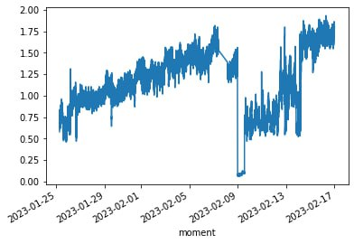

# Самая не амбициозная команда участвует в хакатоне

## Четверг

Неожиданно оказалось, что хакатон на этих выходных, я думала, что на следующих. Блин-компот, я ничего не успеваю.

Я думала, что хакатон будет в течении субботы-воскресенья, но присмотревшись повнимательнее к расписанию обнаружила, что сдача работ уже в воскресенье в 10 утра. аааааааа

Вечером должны  дать доступ к данным в кафке, которые надо анализировать и обрабатывать. В чате участников был смешной мем.

В чате нашей команды был актуален другой мем:

Четверг я работаю днем, учусь вечером, и та же фигня в пятницу. Не спать ночью не для моего потрепанного организма. То есть приступить к хакатону я смогу только в субботу утром.

Пересчитываемся командой. У нас две бекендерки и дата аналитик. Впадаем в панику, явно не хватает компетенций. Паникуем в чате, приходит фронтендерка и умеющая учить машины думать по-человечески. Но эти цчастницы команды не успели зарегистрироваться на хакатон, еще немного переживаем, что это не по правилам и нас дисквалифицируют.

Теперь паникуем все вместе. Подозреваем, что не успеем. Утешаем друг друга, что мы не будем биться за призовое место, а просто пробуем свои силы. Проговариваем, что ночью будем спать, не ждем друг от друга ударной работы.

18:00 дают доступ к кафке, и в чате видно, что многие команды приступили к разработке. Страшно.

Немного про задачу: в кафке  данные с большой железки с металургического производства, надо эти добро показать пользователю, плюс построить предсказание когда железка сломается. В интерфейсе три экрана. Один из них:

В нашей команде модулем предсказаний занималась Ирина Шпаковская, она занялась данными сразу же в четверг и получила крутые  результаты.

Мысли Иры: самое пугающее для аналитицы с малым опытом работы, что данные лежали только в кафке. То есть нужно дергать девушек, чтобы кто-то добыл данные для построения моделек. Решила попробовать выгрузить сама и получилось!

## Пятница

Я опять на работе.

В 17:00 торжественное открытие хакатона, я смотрю на ютубе, когда еду с работы домой в метро, пересаживаясь на трамвай. Открытие проведено прямо на крутом уровне: настоящая студия как в телевизоре, бодрый болтун-ведущий. Очень красывые ролики как круто работать на ЕВРАЗ. Кажется там озвучивается, что у каждой команды будет индивидуальный созвон с экспером, причем первый в 11 утра, то есть когда мы только-только начнем работать. Опять страшно. Заскриншотила экран презентации, как примерно должна быть задизайнена система. Примерно так мы и сделали.

В 18:00 предполагается что начинается работа в командах. Но у нас продолжается наша обычная рутина, мы смогли собраться поговорить в 22:00. 

Решили просто делать архитектуру как на картинке от эксперта. Распределили модули между собой:

- Consumer, который забирает данные с кафки: **Анна Савиновских**, java
- Prediction, магия предсказания поломок, аналитика: **Ирина Шпаковская, Валерия Бурова**, python
- API, бекенд, который отдает все получившееся фронту: **Мария Осипенко**, go
- Frontend: **Катя О**

 Объем работы пугал, например, Кате (фронтенд) одной нужно было сделать 3 действительно сложных экрана. 
 
 Число показателей было более 700, поэтому надо было еще разобраться, что грузить в базу данных, а что нет. И как правильно спроектировать БД?

В 00:00

"Смущает что есть какой-то xlsx файл который содержит дофига инфы (расшифровки кафка-сообщения) и надо бы и его парсить, а там такая древовидная структура что я помру".

 
 
 ## Суббота
 Цитата дня: "даже если мы обосремся - мы это сделаем качественно!"
 
 В 11 утра у нас была встреча с экспертом, мы только начали работать, вопросов было немного, но мы их наскребли. Эксперт отвечал максимально философски, так что это было не особо полезно, должна была быть еще встреча с ним же вечером, но мы ее отменили ввиду полной бесполезности. 

В чате всех участников было видно, что у многих команд проблемы с подключением к кафке, скоростью забора данных. Нашу команду не обошла эта проблема.

Кроме того, количество данных конечно поражало тем, что нифига не понятно, что отбрасывать, что хранить

Спасибо Ане, что она быстро внесла изменения в поля, чтобы в блоке аналитике, можно было легче найти нужный эксгаустер. :) 

Тем не менее, Ирина показала офигенное: 

Полдня ушло на попытки запустить docker-compose. (Мучала вопросами чат BeerPHP SPB, там мне очень помогли, спасибо большое) В итоге оно собралось и работало. Ура! Мой первый самостоятельный контейнер. Dokerfile под свой язык каждая писала самостоятельно. 

Сделались зачатки API (ура, мой первый endpoint на go):

И зачатки интерфейса: 

На этом мы и остановились, решили наше решение не сдавать.

## Итого

Не смотря на то, что собственно саму задачу мы не успели сделать, я была очень вдохновлена хакатоном: у меня как крылья выросли, появилось куча сил и энергии. От хакатона я не хотела все успеть, а хотела попробовать себя в go и понять, как делать для своих проектов контейнеры, как деплоить их на хостинг. И этого я достигла. Кроме того, было невероятно хорошо работать в команде, мне сразу захотелось мутить вместе стартап. Чтобы все прямо успевать на таких мероприятиях надо за неделю-две сделать структуру проекта. Взять отгулы на дни проведения и да, не спать. Но это не было нашей целью.

